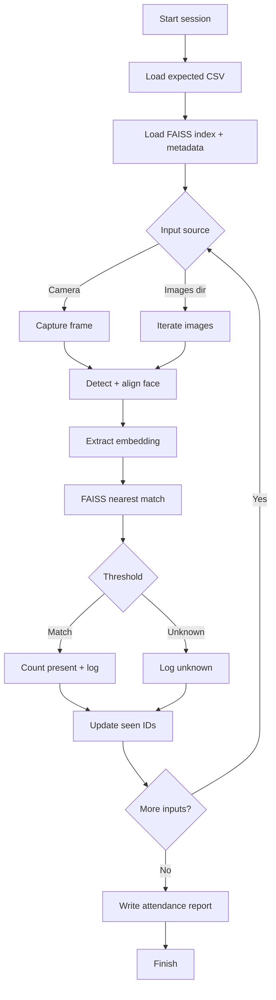

# Face Recognition MVP

Minimal face recognition pipeline using pretrained InsightFace models and FAISS,
with enrollment, recognition, and attendance reporting.

## Why this project
Attendance tracking is often manual, slow, and error-prone. This MVP explores a
lightweight, offline-first workflow that can recognize enrolled identities and
produce reliable attendance reports with minimal setup.

## Highlights
- Face detection, alignment, and embedding (RetinaFace + ArcFace)
- FAISS vector search with cosine similarity
- Batch enrollment from folder structure
- Single-image or webcam recognition
- Attendance session with expected list + absent report

### Session workflow (session_attendance.py)


**Framework mapping**
- Input: `load_image_rgb`, `capture_from_camera`
- Face pipeline: `detect_face` → `align_face` → `extract_embedding`
- Matching: `find_best_match` + `decide_identity` (threshold)
- Attendance logic: `AttendanceState` + `append_event` + `write_attendance_report`

  
## Contents
- Quick start
- Project layout
- Enrollment
- Recognition
- Attendance session
- Outputs


## Quick start
```bash
python -m venv .venv
source .venv/bin/activate
pip install -r requirements.txt
```

## Project layout
```
face_recognition_mvp/
  src/                    # core face pipeline
  enroll.py               # build the face database from enroll_root/
  recognize.py            # single image or webcam recognition
  session_attendance.py   # attendance session + report
  data/enrollments/       # sample CSVs for expected students
```

## Workflow
1. Enroll faces into a database.
2. Recognize from image or webcam.
3. Run attendance with expected list and report output.

## Pipeline overview
1. Detect + align faces from input frames or images.
2. Extract embeddings with a pretrained model.
3. Search the FAISS index for the nearest identity.
4. Apply a threshold to decide identity vs. unknown.
5. Log events and generate a final attendance report.

## Enrollment
Folder structure:
```
enroll_root/
  person_a/
    img1.jpg
    img2.jpg
  person_b/
    img3.jpg
```

Build the database (averages embeddings per person folder):
```bash
python enroll.py --enroll_dir enroll_root --db_dir database
```

## Recognition
Single image:
```bash
python recognize.py --image path/to/test.jpg --db_dir database --threshold 0.6
```

Webcam:
```bash
python recognize.py --camera --db_dir database --threshold 0.6
```

Top-k results:
```bash
python recognize.py --image path/to/test.jpg --db_dir database --top_k 3
```

Save a visualization:
```bash
python recognize.py --image path/to/test.jpg --db_dir database --save_vis --output outputs/result.jpg
```

## Sample data
If you want to try the pipeline with a public dataset, download:
https://www.kaggle.com/datasets/vishesh1412/celebrity-face-image-dataset

## Attendance session
Run a session that loads the enrolled students once, counts only expected identities,
and produces a final attendance report with PRESENT/ABSENT for each student.

Expected-students CSV must include a `student_id` (or `id`) column. Optional `full_name`.
Sample lists are provided in `data/enrollments/`.

Camera session:
```bash
python session_attendance.py \
  --faculty "Engineering" \
  --department "Computer Science" \
  --course "CS101" \
  --expected_csv data/enrollments/CS101.csv \
  --camera \
  --db_dir database \
  --threshold 0.6
```

Process a folder of images:
```bash
python session_attendance.py \
  --faculty "Engineering" \
  --department "Computer Science" \
  --course "CS101" \
  --expected_csv data/enrollments/CS101.csv \
  --images_dir path/to/session_images \
  --db_dir database \
  --threshold 0.6
```

## Outputs
| Artifact | Path |
| --- | --- |
| Event logs | `attendance_logs/` |
| Attendance reports | `attendance_reports/` |
| Recognition visualizations | `outputs/` |
